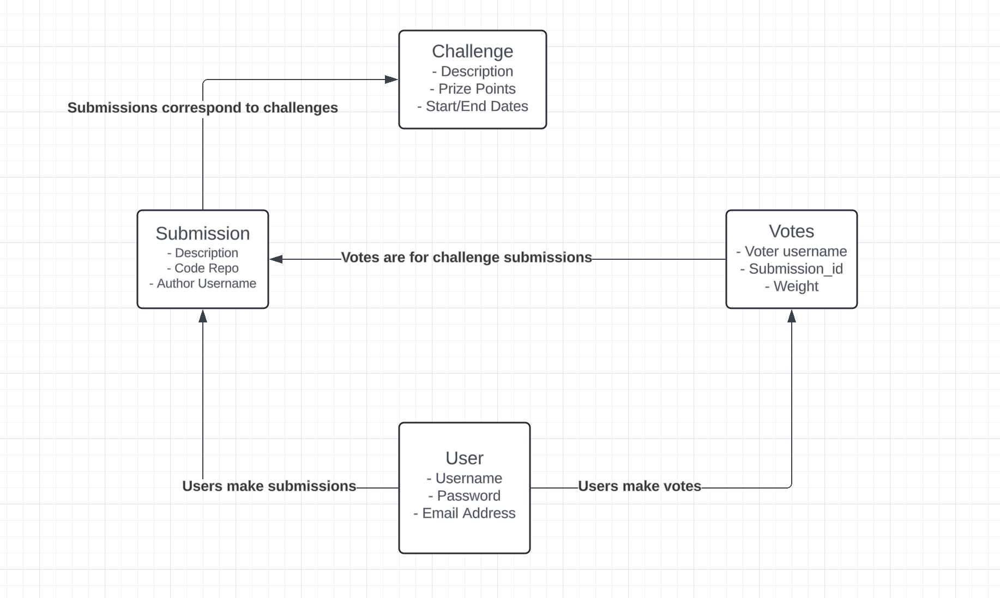

# Code Challenge Social Leaderboard

## Overview

The objective is to create a social platform centered around coding challenges.

People who want to participate on the platform should be able to register a new account with a (username, password) pair to become a `user` on the platform.

Priveledged users should be configurable. That's to say, there should be some mechanism for securely designating certain `user`s as an `admin`.

An `admin` may create `challenge`s. A `challenge` has a description or objective, a start_date, an end_date, and an optional news_frequency. The news_frequency is the frequency at which participants in the challenge should post status updates in the form of a mini blog post in order to be considered active in the challenge.

A `user` should be able to register for a `challenge`. This should be as simple as clicking a button before the `challenge` start_date. The `user` should then be able to link a github or gitlab repository to their `challenge_submission`. A `user` should also be able to post `update_news` to their `challenge_submission`.

A `user` should be able to vote for their favorite `challenge_submission`s. You should not be able to vote for your own submission. A [ranked choice voting system](https://en.wikipedia.org/wiki/Ranked_voting) will be employed where a `user` gets 3 `votes`, one of weight x3, one of weight x2, and one of weight x1.

For each challenge, there should be a page /leaderboards/{challenge_id} which displays a leaderboard where `challenge_submission`s are sorted by the weighted sum of their votes. The leaderboard page should also display a countdown to the `challenge`'s end_date.

## Architecture

The app will be composed of 2 REST microservices on the backend. One microservice for user management and authentication and one microservice for managing challenges and voting.

The users microservice will store persistent user details in a SQL table while ephemeral user sessions will be tracked in a Redis database.

The challenges microservice will store details about each challenge and the challenge submissions in the SQL table. It makes REST calls to to the users microservice for user identification and authentication. APIs in the which require authentication will require a `session_id` cookie from the users microservice login.

The JavaScript client application will make calls to both of these services to render the frontend.


## SQL Database Model



## Infrastructure

The `infrastructure` folder defines the infrastructure necessary to deploy the application, as code.

`infrastructure/docker-compose.yml` defines a deployment template to run all the necesssary services on a single host.

The template includes
* a Redis server
* a MySQL server with a database schema defined in `infrastructure/schema.sql`
* A REST server for the users microservices defined in `infrastructure/Dockerfile.users`
* A REST server for the challenges microservices defined in `infrastructure/Dockerfile.challenges`

To run the deployment, navigate to the `infrastructure` folder and run `docker compose up --build`

## Users Microservice

The users microservice will provide a set of REST endpoints for registering new users, authenticating users, creating user sessions and destroying user sessions.

The users microservice will manage a `users` MySQL table on the backend that tracks each user's username, password, and email.

A Redis NoSQL database will be used to store the user sessions details where the keys in the database are session IDs and the values are datum associated with the user session.

### REST Interface

#### Registration

To register a new user, a new row is inserted to the `users` MySQL table including the user's email, username, and a salted [SHA-256 hash](https://en.wikipedia.org/wiki/SHA-2) of the user's password.

Example Request:
```
POST /users/register
HEADERS
    Content-Type: application/json
BODY
    {
        "username": "ben",
        "password": "s3cRetPazzwurd223"
        "email": "ben@mail.net"
    }
```

#### Login

To login a user, the username+password pair is authenticated by looking up the username in the MySQL database, hashing the input with the salt, and then comparing it to the stored password. If the authentication is successful, then a session will be created for the user.

Example Request:
```
POST /user/login
HEADERS
    Content-Type: application/json
BODY
    {
        "username": "ben",
        "password": "s3cRetPazzwurd223"
    }
```

#### Whoami

This route looks up the session cookie in the Redis database and should return details about the associated user.

```
GET /users/whoami
HEADERS
    Cookie: session_id=abc123
```

#### Logout

The logout command destroy's the user's current session on the backend by deleting the session key from Redis.

```
POST /users/logout
```

### Testing

To run the test suite for the users microservice:

* Startup the application according to the deployment instraction in the infrastruction section
* Navigate the the users microservice directory `cd backend/users_microservice`
* Install the Python module dependencies `python3 -m pip install -r requirements.txt`
* Run the test suite `python3 -m pytest`

## Challenges Microservice

The challenges microservice manages a user's interaction with the challenge/leaderboard/voting aspect of the application.

### REST Interface

#### Create a Challenge

Create a new challenge by specifying a challenge name, objective/description, a start date, and challenge end date.

Only available to `admin` users.

Example Request:
```
POST /challenges/create
HEADERS:
    Content-Type: application/json
    Cookie: session_id=abc123
BODY:
    {
        "name": "CRUD App Challenge",
        "description": "Participants will create an application that incorporates the fundamental operations of Create, Read, Update, Delete (CRUD). This challenge aims...",
        "start_date": 1701882792,
        "end_date": 1713882816
    }
```

#### Register for a Challenge

A user may POST to this route before the challenge's start_date to register (aka signal intent to participate in) for an up coming challenge.

The user must be logged in to use this route.

Example Request:
```
POST /challenges/register/{challenge_id}
HEADERS:
    Content-Type: application/json
    Cookie: session_id=abc123
```

#### Link Project to Submission

```
POST /challenges/submission/link_project/{submission_id}
HEADERS:
    Content-Type: application/json
    Cookie: session_id=abc123
BODY:
    {
        "link": "https://github.com/benevanoff/social-code-challenges"
    }
```

#### Post News for Submission

```
POST /challenges/submission/news/create/{submission_id}
HEADERS:
    Content-Type: application/json
    Cookie: session_id=abc123
BODY:
    {
        "content": "This week we created a technical design document for our social code challenge app. The document describes what our app should do and details the planned architecure for the plan. It also provides a rough plan for the REST interface. This will help us in our planning because..."
    }
```

#### Vote for a Challenge Submission

Vote for a submission. Each user may place three votes per challenge, each with a different weight. The weights act as multipliers. A vote with weight 3 gives 3 points while a vote with weight 1 only gives 1 point. A user may use each weight only once per challenge.

```
POST /challenges/submission/vote/{submission_id}
HEADERS:
    Content-Type: application/json
    Cookie: session_id=abc123
BODY:
    {
        "weight": 3
    }
```

#### Get Challenge Leaderboard

List the top 10 submissions for a challenge, sorted by sum of votes.

```
GET /challenges/submissions/{challenge_id}
```

### Testing

To run the test suite for the challenges microservice:

* Startup the application according to the deployment instraction in the infrastruction section
* Navigate the the users microservice directory `cd backend/challenges_microservice`
* Install the Python module dependencies `python3 -m pip install -r requirements.txt`
* Run the test suite `python3 -m pytest`

## User Interface

TODO
